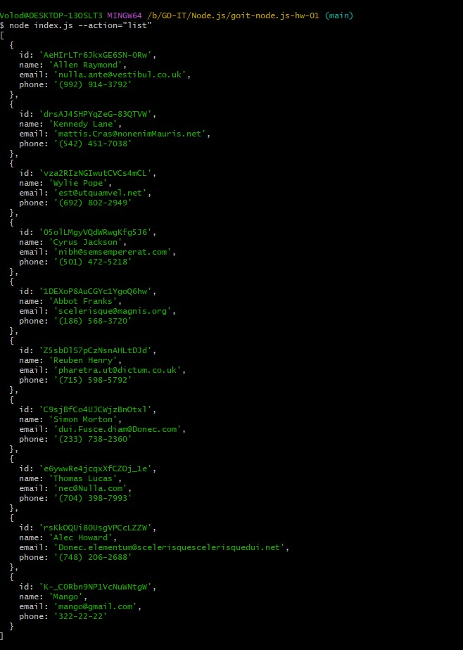
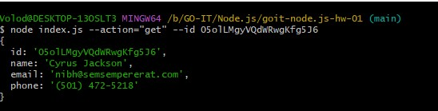
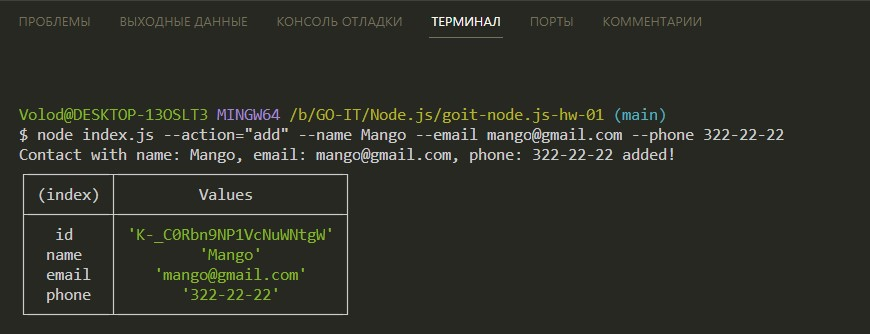
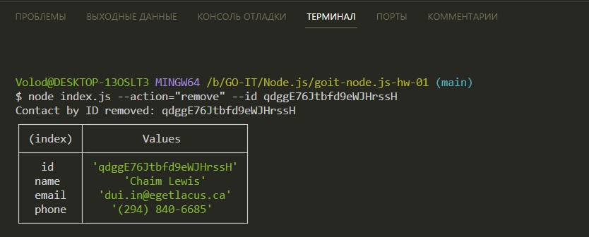

# goit-node.js-hw-01

1. Отримуємо і виводимо весь список контактів у вигляді таблиці
Команда в терміналі: `node index.js --action="list"`
Приклад результату: https://monosnap.com/file/v1E9krW0K707DO89AZMiPyhkUtx7UZ
;

2. Отримуємо контакт по id
Команда в терміналі: `node index.js --action="get" --id 05olLMgyVQdWRwgKfg5J6`
Приклад результату: https://monosnap.com/file/JwHtOlO1RgOGa3y0lr47C2rnVoYPEs
;

3. Додаємо контакт
Команда в терміналі: `node index.js --action="add" --name Mango --email mango@gmail.com --phone 322-22-22`
Приклад результату: https://monosnap.com/file/2tYpV1RHz9kkUAWH9jSQ6JCw8ff1aw
;

4. Видаляємо контакт
Команда в терміналі: `node index.js --action="remove" --id qdggE76Jtbfd9eWJHrssH`
Приклад результату: https://monosnap.com/file/ibrE7yfB3wM4xMRonCqhiBqkHfYJUp
;