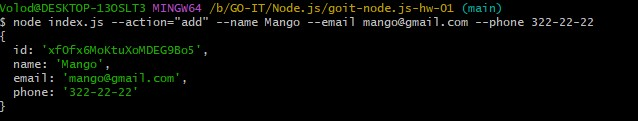
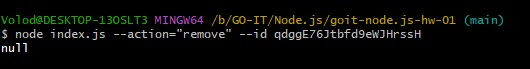

# goit-node.js-hw-01

1. Отримуємо і виводимо весь список контактів у вигляді таблиці

Команда в терміналі: `node index.js --action="list"`

Приклад результату: https://monosnap.com/file/uqd4G1pPDvhBQPVj4LmqLdypPCpU5i
;

2. Отримуємо контакт по id

Команда в терміналі: `node index.js --action="get" --id 05olLMgyVQdWRwgKfg5J6`

Приклад результату: https://monosnap.com/file/JbDjlHKCQ3bKlXLYlBTBHNGvCMGJVn
;

3. Додаємо контакт

Команда в терміналі: `node index.js --action="add" --name Mango --email mango@gmail.com --phone 322-22-22`

Приклад результату: https://monosnap.com/file/ClON1otbQQVfz9vDUtPTqKkhXh55Tk
;

4. Видаляємо контакт

Команда в терміналі: `node index.js --action="remove" --id qdggE76Jtbfd9eWJHrssH`

Приклад результату: https://monosnap.com/file/wAKMDxPaZnQHcInFIKFDO1bwaqCwtc
;